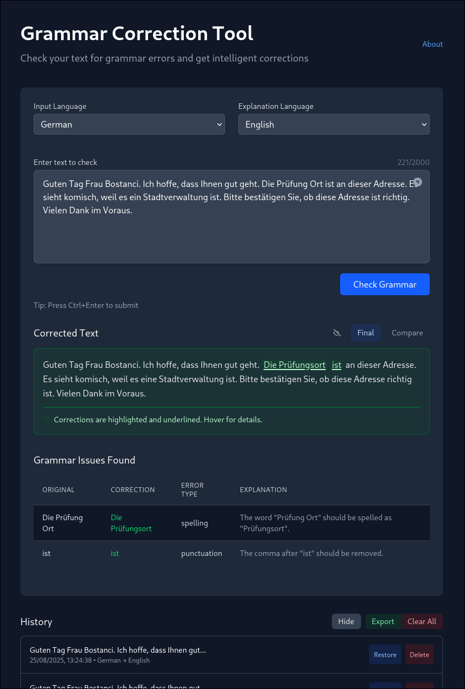

# Grammar Correction Tool

A mobile-first web application that analyzes user-submitted text for grammar errors and provides intelligent corrections using OpenRouter's LLM API.



## Features

- **Text Analysis**: Check sentences or paragraphs for grammar errors
- **Intelligent Corrections**: Get rewritten, grammatically correct versions of your text
- **Error Documentation**: View detailed information about grammar issues in a structured table
- **Multi-language Support**: Select input text language and preferred language for error explanations
- **History Management**: Store correction history in localStorage for easy reference
- **Export History**: Export your correction history as JSON
- **Keyboard Shortcuts**: Use Ctrl+Enter to quickly submit text
- **Mobile-First Design**: Optimized for all device sizes with responsive design

## Getting Started

### Prerequisites

- Node.js (version 18 or higher)
- npm or yarn
- An OpenRouter API key (free at [openrouter.ai](https://openrouter.ai))

### Installation

1. Clone the repository:
   ```bash
   git clone <repository-url>
   cd grammarcheck
   ```

2. Install dependencies:
   ```bash
   npm install
   ```

3. Create a `.env.local` file in the root directory with your OpenRouter API key:
   ```env
   OPENROUTER_API_KEY=your_openrouter_api_key_here
   NEXTJS_URL=http://localhost:3000
   OPENROUTER_MODEL=mistralai/mistral-7b-instruct:free
   ```

4. Run the development server:
   ```bash
   npm run dev
   ```

5. Open [http://localhost:3000](http://localhost:3000) in your browser.

### Docker Installation

Alternatively, you can run the application using Docker:

```bash
docker build -t grammar-check .
docker run -p 3000:3000 -e OPENROUTER_API_KEY=your_api_key_here grammar-check
```

## Usage

1. Enter or paste text into the input field
2. Select the input language and preferred explanation language
3. Click "Check Grammar" or press **Ctrl+Enter** to analyze your text
4. View the corrected text and error explanations
5. Access your history to restore previous corrections

## Keyboard Shortcuts

- **Ctrl+Enter**: Submit text for grammar checking

## Project Structure

```
src/
├── app/                    # Next.js app directory
│   ├── api/               # API routes
│   │   └── grammar-check/ # Grammar checking endpoint
│   ├── page.tsx           # Main application page
│   └── layout.tsx         # Application layout
├── components/            # React UI components
├── lib/                   # Business logic and utilities
└── types/                 # TypeScript type definitions
```

## Documentation

For detailed documentation, please see the [docs](docs/) directory:

### For Users
- [User Guide](docs/user/USER_GUIDE.md) - Instructions for using the application

### For Developers
- [AI Development Guide](docs/developer/AI_DEVELOPMENT_GUIDE.md) - Guidelines for AI assistants working on the project
- [TDD Guide](docs/developer/TDD_GUIDE.md) - Test-Driven Development approach

### For Technical Users
- [Technical Documentation](docs/technical/TECHNICAL_DOCS.md) - In-depth technical information

### For Testers
- [Test Plan](docs/testing/TEST_PLAN.md) - Comprehensive testing strategy

### For an overview of all documentation, see [docs/README.md](docs/README.md).

## Technologies Used

- [Next.js](https://nextjs.org/) - React framework with hybrid static & server rendering
- [TypeScript](https://www.typescriptlang.org/) - Typed JavaScript for better development experience
- [Tailwind CSS](https://tailwindcss.com/) - Utility-first CSS framework
- [OpenRouter API](https://openrouter.ai/) - Access to various LLMs through a single API
- [React](https://reactjs.org/) - JavaScript library for building user interfaces

## Environment Variables

The application uses the following environment variables:

- `OPENROUTER_API_KEY` - Your OpenRouter API key (required)
- `NEXTJS_URL` - The URL where your application is hosted (required for API referer)
- `OPENROUTER_MODEL` - The OpenRouter model to use (optional, defaults to `mistralai/mistral-7b-instruct:free`)

## Deployment

To deploy this application:

1. Set the environment variables in your deployment platform:
   - `OPENROUTER_API_KEY`
   - `NEXTJS_URL` (your deployed URL)
   - `OPENROUTER_MODEL` (optional)

2. Build the application:
   ```bash
   npm run build
   ```

3. Start the application:
   ```bash
   npm start
   ```

## Contributing

We welcome contributions to improve the Grammar Correction Tool:

1. Fork the repository
2. Create a feature branch (`git checkout -b feature/AmazingFeature`)
3. Commit your changes (`git commit -m 'Add some AmazingFeature'`)
4. Push to the branch (`git push origin feature/AmazingFeature`)
5. Open a pull request

## License

This project is licensed under the MIT License - see the [LICENSE](LICENSE) file for details.

## Support

For issues, questions, or suggestions:
1. Check the [GitHub issues page](https://github.com/your-repo/issues)
2. Submit a new issue with detailed information
3. Include browser information and steps to reproduce issues

## Acknowledgements

- Thanks to [OpenRouter](https://openrouter.ai/) for providing access to powerful LLMs
- Built with [Next.js](https://nextjs.org/) and [Tailwind CSS](https://tailwindcss.com/)